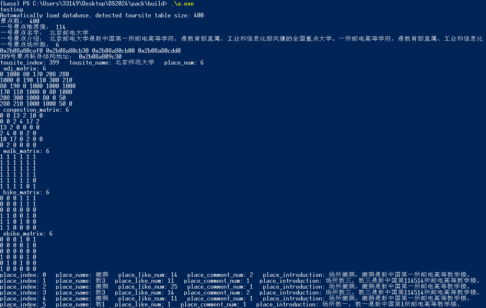
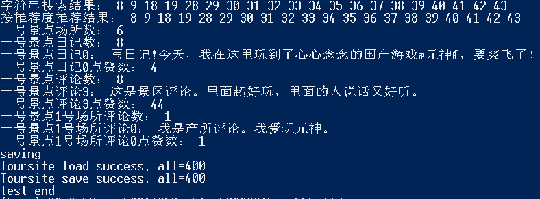

# DS2024 - shc 
| 所有接口已经过测试,基本可用。

## Test.cpp

test.cpp - 0.4.0

## Bugs
* 文件读取字符串过长会失败，暂时不支持更长的景点介绍。
* 千万不要试图用IDE打开Database/toursite_table.csv，会发生可怕的事情。
---

## Development Log

### 2024.6.4
* 完成开发：实装ACA+KMP

### 2024.6.2
* 完成开发：一些TableBase子类可以实现数据的随机生成
* 数据更新：使用伪随机信息对景区comments和diary中的重复信息完成了替换

### 2024.5.10 
* 完成开发: TableMatrixRoute & TableRoute & TablePlaces etc.
* 完成开发: 拥塞矩阵和道路可通过矩阵的存储
* 完成测试: 拥塞矩阵和道路可通过矩阵相关服务
* 完善数据: 用更符合常识的数据替换了旧数据，现在更加逆天了
* 目前所有接口已完成初步测试
* 数据库扩容: 景点数增至400

### 2024.5.7 
* 完成开发: 评价&日记查询
* 完成测试: 评价&日记查询
* 正在开发: Map<>,(HashMap?)
* 正在开发: StringChunkList, 为TableBase实现内嵌AC自动机

### 2024.5.5 
* 新增功能: 评价&日记查询
* 扩展接口: Database_IF
* 完成开发：TableBase接口
* 完成开发: TableComments & TableDiary 用于加载评价表格和日记表格
* 完成开发: TablePlaceComments  用于加载评价表格
* 完成开发: 所有存盘功能
* 正在开发: Table*的增删功能, 添加评论、日记

### 2024.5.5 
* 完成开发: 数据结构ChunkList<>用于替代vector<>
* 正在开发:TableBase用于加载关系型数据库表格
* 将开发: TableComments & TableDiary 用于加载评价表格和日记表格
* 正在开发: 以Tousite为单位数据保存硬盘

### 2024.5.4 
* 新增自动加载景点信息功能，以实现动态加载。
* 修改了导致编译器'warning'的代码。
* 正在开发: List和ChunkList。